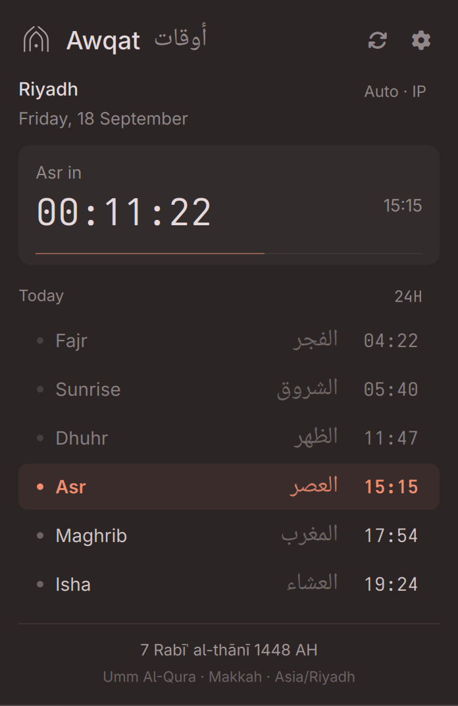

# Awqat · أوقات

**Prayer times, quietly in your bar.**

Awqat is a simple, lightweight prayer-times plugin for Omarchy, powered by
Rust. See your next prayer at a glance, check the whole day, and hear the
adhan when it is time. The everyday features you need, in a small panel that
follows your desktop theme.

Its native helper is about **724 KiB** on ARM64 and exits when its work is
done. The panel loads when you open it and unloads when you close it.

## Install

First prepare the build dependencies using your normal system package tools:
Rust/Cargo 1.89+ (`rust` on Omarchy), a C toolchain and pkg-config
(`base-devel`), and system libcurl development files. Awqat checks for these
tools and stops if they are missing; it does not install or upgrade system
packages. Building may download the Rust dependencies pinned in `Cargo.lock`.

```sh
omarchy plugin add https://github.com/iYassr/awqat
cd ~/.config/omarchy/plugins/yasserdo.awqat
./build.sh
omarchy plugin enable yasserdo.awqat
```

Requires Omarchy 4 with the Quickshell shell, system libcurl, and timezone
data. Build the helper before enabling the plugin. Rust/Cargo 1.89+, a C
compiler, and pkg-config are needed for the build; Python is not required
at runtime. Notifications use `notify-send`; optional audio uses `mpv`.

## Small, with the essentials included

- **A glance is enough.** Keep the next prayer and its time in your bar.
  Open the panel for all five prayers, sunrise, Arabic labels, the Hijri
  date, and a live countdown.
- **Finds your location.** Start with automatic IP detection, or choose a
  city yourself. Pick the calculation method and Asr school you follow.
- **Fits your desktop.** Colors follow your Omarchy theme. Choose a bar
  layout, see how it looks, or write your own format. Show as much or as
  little as you want.
- **A reminder your way.** Turn on a notification, a gentle chime, a bell,
  the full adhan, or your own audio file. Preview it and set the volume
  before saving.
- **Keeps the day available.** Cached prayer times remain visible when the
  connection drops. Awqat retries automatically and remembers alerts it
  has already sent.
- **Stays out of the way.** A small Rust helper, one shared updater across
  monitors, and no persistent helper daemon.

## Your day, one click away



A real Awqat panel on Omarchy. The next prayer stands out; the rest of the
day stays easy to scan.

Click the Open sanctuary icon in your bar to open it. The gear takes you to
**Location**, **Bar**, and **Alerts**. Switch between **12H / 24H** in the
panel, or middle-click the bar widget to refresh.

## Make it yours

Keep just the time, add the prayer name, show a countdown, or use Arabic.
Every preset has a live preview. Custom formats let you choose the exact
words and separators:

```text
{name} · {time24}      → Dhuhr · 11:47
{arabic} · {time}      → الظهر · 11:47 AM
{name} in {remaining} → Dhuhr in 2h 3m
```

Notifications and sound start off. In **Alerts**, choose what you want to
hear, try **Preview**, and save. Closing the panel lets the adhan continue;
use **Stop prayer audio** when you want to stop it.

The included adhan choices are Ahmad al-Nafees and Mishary Rashid Alafasy.
Recordings download only when selected or previewed. You can also choose a
local audio file.

## Location and timing

Automatic location uses [ipwho.is](https://ipwhois.io/documentation).
Manual city search uses [Open-Meteo](https://open-meteo.com/en/docs/geocoding-api),
and prayer times come from [AlAdhan](https://aladhan.com/prayer-times-api).
A VPN can affect the detected city; check the city shown in the panel and
switch to manual location if needed.

Automatic calculation uses Umm al-Qura in Saudi Arabia. You can change the
method in settings. These are prayer start times; your mosque's iqamah may
be later. Alerts need an awake device and a running Omarchy shell. Prayers
missed by more than 90 seconds are not replayed after waking.

## Update

```sh
omarchy plugin update yasserdo.awqat
cd ~/.config/omarchy/plugins/yasserdo.awqat
./build.sh
omarchy restart shell
```

Rebuild after source updates. Your saved settings and downloaded audio
carry over.

## Remove

```sh
cd "$HOME"
omarchy plugin remove yasserdo.awqat
```

This removes the plugin folder, including local code changes. Its downloaded
audio and cached times remain in `${XDG_CACHE_HOME:-~/.cache}/omarchy-awqat`;
alert history remains in `${XDG_STATE_HOME:-~/.local/state}/omarchy-awqat`.
You can delete those two folders if you also want to clear Awqat's data.
To hide it temporarily, use `omarchy plugin disable yasserdo.awqat`.

## A few more details

- [Technical notes](docs/TECHNICAL.md): all format tokens, commands, setup,
  troubleshooting, and development checks.
- [Performance and reliability review](REVIEW.md): measurements and their
  limits. The 724 KiB figure covers the ARM64 helper binary, excluding
  shared libraries, the Omarchy shell, and optional audio.
- [Privacy and security](SECURITY.md): network services, local storage, and
  trust boundaries.
- [36 logo concepts](https://github.com/iYassr/awqat/releases/download/v1.2.2/logo-gallery.html):
  download and open the offline gallery to try palettes, preview bar sizes,
  and save your favorites. Awqat uses **03 · Open sanctuary**: two embracing arches around a central light.

Code and vector artwork use the [MIT license](LICENSE). Adhan recordings
come from [AlAdhan](https://aladhan.com/download-adhans), are not bundled,
and remain subject to their owners' terms.
